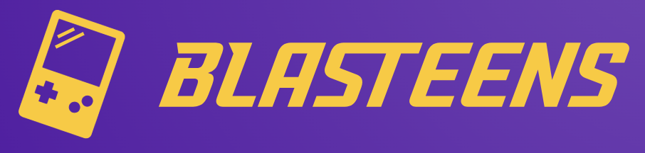

# Blasteens SDK
<p align="center">
  
</p>

Blasteens SDK is tailored for game developers, streamlining integration with the Blast Chain and smart contracts seamlessly. Specifically designed for talented game developers unfamiliar with crypto wallet connections and smart contract deployment, it simplifies the process. Blasteens SDK aims to empower game developers to explore the potential of blockchain gaming, fostering inclusivity within the GameFi community.
<br>
> Want to know more about Blasteens? [visit us](example.com) !!!

## Table of Contents
* [Arcade SDK](#arcade-sdk)
  * [Overview](#overview)
  * [Features](#features)
  * [Config](#config)
  * [Usage](#usage)
  * [Deploy](#deploy)
* [Indie-Game SDK](#indie-game-sdk)
* [License](#license)
* [Developed By](#developed-by)
## Arcade SDK
  ### Overview
  The Blasteens Arcade module leverages Redux for efficient state management, automating leaderboard maintenance and simplifying player score handling. It ensures a smooth end-to-end gaming session, encouraging developers to embrace a recommended design pattern for consistent score integration. Following a carnival-inspired rule of providing a ticket with limited chances, each tryout concludes by showcasing the player's score and the highest score of their round.
  
  > For those pursuing more ambitious projects, the [Indie-Game SDK](#indie-game-sdk) provides enhanced flexibility and customization options within the Blasteens ecosystem.)

  > The following usage example is created using _[Phaser](https://phaser.io/)_, a recommended tool for crafting arcade games on Blasteens Arcade.
 
  ### Features
- Designed to interact with Redux store for state management.
- Integrates with the Blasteens Arcade system for ticketing, leaderboard, and game flow.
- Suitable for incorporation into game development projects.
  <hr/>
- `useLives()`: Decreases the number of lives in the game.
- `startGame(callback)`: Initiates the game, checks lives, and triggers a callback if lives are available; shows the ticket window otherwise.
- `endGame(callback)`: Ends the game, allows leaderboard sync, shows the ticket window, and triggers a callback.
- `updateHighScore(score)`: Updates the game's high score in the leaderboard.
- `resetGameScore()`: Resets the game score in the leaderboard.
- `getLives()`: Retrieves the current number of lives in the game.

### Usage
The main menu is crafted for the pre-game menu experience.
```javascript
// MainMenu.js
import { createGameSDK } from "blast-game-sdk"; // import the Blasteens SDK package

export default class MainMenu extends Phaser.Scene {
  constructor() {
    super("MainMenu");
    this.sdk = createGameSDK("snowmanDefender"); // use sdk to build the game
  }

  /* ...rest of the code...*/

  this.input.on("pointerdown", () => {
    this.sdk.startGame(() => { // use sdk to start the game
      this.scene.start("MainGame");
    });
  });
}
```
The MainGame.js file serves as the primary scene for gameplay in the game.
```javascript
// MainGame.js
export default class MainGame extends Phaser.Scene {
  constructor() {
    super("MainGame");

    this.player = null;
    this.tracks = null;

    this.score = 0;
    this.infoPanel = null;

    this.scoreTimer = null;
    this.scoreText = null;
    this.sdk = createGameSDK('snowmanDefender') // SDK build the game
  }

  /* ...your game design... */

  create() {...}

  gameOver() {
    
    /* ...finish this round... */

    this.sdk.useLives(); // SDK would count the remaining chances for the player
    this.sdk.updateHighScore(this.score); // SDK would also store the high score
    this.sdk.endGame(() => { }); // let SDK to handle ending the game

    this.input.once("pointerdown", () => {
      this.scene.start("MainMenu"); // the game would back to menu
    });
  }
}
```
### Config
There should be a main file serving as a configuration file for the game. Kindly adhere to the provided format below.
```javascript
// main.js
export const config = {
  title: "Snowman Defender", // set up your game name
  type: Phaser.AUTO,
  backgroundColor: "#3366b2",
  physics: {
    default: "arcade",
    arcade: { debug: false },
  },
  scale: {
    parent: "gameDisplay", // ensure the parent is "gameDisplay"
    mode: Phaser.Scale.FIT,
    width: 1024,
    height: 768,
  },
  scene: [Boot, Preloader, MainMenu, MainGame], // load the game scenes
};
```
> Ensure proper setup of the asset URL by using: `this.load.setPath("../../assets/games/{your_game_key}/");`
> If you encounter any issues, don't hesitate to get in touch with us.
### Deploy
Once your game development is complete, please compress your files into a zip archive and send it to us. The zip file should contain two folders: one for the game itself and another for assets, encompassing elements like images, fonts, music, etc. The folder should have the similar structure as shown below:

```plaintext
game.zip
├── game
│   ├── main.js
│   ├── Boot.js
│   ├── MainMenu.js
│   ├── Game.js
│   └── (_other components_)
└── assets
    ├── images
    │   ├── (_image files_)
    ├── sounds
    │   ├── (_sounds files_)
    └── (_other asset folders_)
```
> Additionally, please include a game description, and remember to incorporate the game logo located in `/assets/images`.
## Indie-Game-SDK
> Stay tuned, coming soon!
## License
## Developed By
- The SDK is developed by _Scorpion Studio_.
  <p align="left">
    
  </p>
- Also, special thanks to _[Blast](https://blast.io/en)_ !
  <p align="left">
    
  </p>
